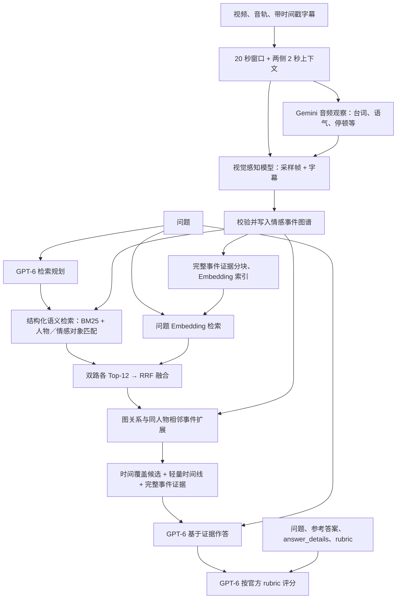

# LongEmoBench

[中文](README_zh.md) · [Dataset on Hugging Face](https://huggingface.co/datasets/mcflurryshuoz/LongEmoBench/tree/main)

LongEmoBench evaluates emotion understanding at two video granularities: **clip** and **episode**. Questions cover emotion recognition, transitions, trajectories, causes, intensity comparisons, and reasoning across a longer video. All tasks use open-ended questions; the expected answer may be emotion labels, a short result, or a natural-language explanation.

This repository provides prediction generation and a shared evaluator. Predictions from your own model or agent can be evaluated directly. **Evaluation requires question annotations and predictions; it does not load videos or subtitles.**

## 当前实验：noevent 全集

本分支仅感知**时间窗口记录**，不生成事件、情感状态节点或关系边；在窗口记录上用 BM25＋Gemini Embedding 2 检索，由 GPT-6 回答并按官方标准评分。

本次固定 **558 题／141 视频**，统一使用 Gemini 3.8 Flash 音视频感知。全集脚本先等待当前 50 题试跑结束并核验继承，随后以最多 **12 视频并发、每视频 2 题并发** 优先运行 noevent，再运行共享事件图的 base／method。逐视频接收媒体、完成感知后立即答题评分；保留首次有效成绩和失败记录。[启动命令与评测协议](experiments/zyf/full_suite.md)。

下方保留事件图方法和历史成绩供对照；历史 60.24／57.62 **不是本次 noevent 或三层消融成绩**。

## method 分支：完整事件流检索方法

本分支在原有 benchmark 和评测器上实现了**情感事件记忆图谱 + 结构化语义／Embedding 双路检索**。方法概括为：先将视频按时间窗口切分，由音频和视觉模型提取带时间戳的人物、事件、情绪状态及证据；再把这些信息写入经过校验的事件图谱，并建立 Embedding 索引。回答问题时，由 GPT-6 规划检索，结合 BM25／人物与情感对象匹配、Gemini Embedding 2 向量召回和 RRF 融合，再沿事件关系扩展上下文，最后由 GPT-6 基于证据作答并按官方 rubric 评分。图谱与问题解耦，可复用已完成窗口和检索缓存。

## noevent 分支：时间窗口消融

本分支用于隔离事件图贡献。已实现窗口级感知记录、窗口级 BM25／Embedding 双路检索和独立 answer CLI；输出不包含事件、状态、关系或跨窗口连续性字段。待同步 pilot 完成后，与 `method` 使用同一感知模型、采样、题单、GPT-6、Embedding 和评分器进行独立评测，方案与公平性约束见[消融方案](experiments/zyf/noevent_plan.md)。



参考答案、`answer_details` 和 `rubric` 只供评测器使用；构图不接收问题，检索和答题不接收参考标注。音频观察是模型提取的证据，保留不确定性。

### 第一步：感知并构建情感事件记忆

1. **按时间切窗。** 每个核心窗口 20 秒，两侧各补 2 秒上下文；按 1 fps 抽帧，保留实际帧时间戳、字幕和源音频的对应关系。新增窗口使用每窗最多 16 帧、每帧最多 150528 像素；已完成窗口保留各自的采样配置与来源。
2. **融合视觉与音频线索。** 独立 Gemini 音频观察器先提取带时间戳的言语、语气、笑声、停顿等；视觉感知模型读取采样帧、字幕、音频观察、已知人物信息及最近 3 个事件，输出人物、可观察线索、事件、情感状态和事件关系。
3. **以事件组织图谱。** 事件关联观察证据，并拥有自己的情感状态。状态区分主体、情感指向对象、情绪、可观察的强度表现、认知解释与不确定性；情感对象与诱因分别表达。关系包括时间关系、因果、状态变化和共存，均保留证据引用。
4. **校验后增量保存。** 新事件归属核心窗口，补充时间段只作上下文；仅在明确为同一持续事件时合并。每个窗口校验时间范围、ID、引用和模态来源，完整通过后原子提交；失败不会写入半个窗口，可以从已验证检查点续跑。

| 记忆内容 | 表达的信息 |
|---|---|
| 人物 `P…` | 名称／外观描述、身份线索与来源 |
| 观察 `O…` | 时间范围、主体、可观察线索、视觉／音频／字幕来源 |
| 事件 `E…` | 时间范围、摘要、观察引用、源窗口、事件内情感状态 |
| 状态 `S…` | 主体、情感对象、情绪、强度表现、解释、不确定性、证据及版本 |
| 关系与溯源 | 事件关系及证据、媒体来源、已完成窗口和修订历史 |

当前事件节点使用 schema v2。每个事件除了时间跨度、摘要和情感状态，还保存 `event_type`、`actions`、`objects`、`participants`、`signals` 和 `confidence`：`signals` 只记录媒体中明确出现的评分、数量、顺序、极值、引用或标签，不由模型臆造数值。这些字段让强度比较和计数题能够按“具体动作／对象／显式信号”检索，而不是只按情绪形容词匹配；旧 schema v1 图谱仍可读取，新增字段只在重新构图时产生。

代码支持历史状态修订和问题内局部回看；**当前评测配置关闭修订，`--max-inspections 0`，答题期间不修改共享图谱**。本轮研究的是从固定事件记忆检索和推理的效果。

### 第二步：双路检索、图扩展与回答

当前 `graph` 基线的两路 seed 都从**已经构建完成的整张事件图**上召回；同人物前后相邻事件只是 seed 之后的导航扩展。`graph_stream` 是一次性事件流上下文的诊断实现，不能保证在预算内保留最相关的后续事件。`progressive` 是本分支的新主候选：把完整事件图当作可查询数据库，先披露少量锚点，再由回答模型通过受控请求逐页展开相关的时间流或关系流，不在第一轮暴露整张图。

为了避免渐进式披露在需要全局对照的题型上丢失证据，当前实现采用题型路由：`emotion trajectory` 使用渐进事件流；`emotional intensity comparison` 和 `emotional reasoning` 回退到与 base 相同的完整图检索，但保留 48000 字符证据预算。这样针对 base 的主要短板分别处理：轨迹题需要跨时间阶段补证据，而强度比较和推理题更依赖同时看到对照项、因果桥和例外，过早分页会把它们拆散。每题的 `method`、路由和证据仍写入 trace，便于与纯 progressive 和 base 做同题比较。

1. **检索规划。** GPT-6 根据问题、视频时长和人物信息，生成任务模式（轨迹／比较／计数／因果／局部）、人物词、情感对象词、扩展查询词及可选时间范围。
2. **结构化语义路。** 对包含人物、状态、观察和关系的事件记录做 BM25，并加入人物匹配与情感对象／情绪匹配：`semantic = BM25 + 3 × entity_match + 2 × target_match`。这里的语义路是规划后的结构化匹配，没有另外调用一个语义重排模型。
3. **Embedding 路。** 将完整事件证据（人物、状态、观察与有效摘要）分为重叠文本块，使用 Gemini Embedding 2 的文档／查询前缀编码为 3072 维归一化向量；问题与文本块计算余弦相似度，每个事件取最高块分数。索引缓存绑定文本内容、模型、服务端点和编码配置。
4. **融合与图扩展。** 两路各取 Top-12，用 RRF（常数 60）融合，再沿显式事件关系及同人物的前后相邻事件扩展。时间邻接用于寻找上下文，不作为因果证据。轨迹、比较、计数和因果题额外从 12 个时间分桶选择覆盖候选。
5. **组织证据并作答。** `graph_stream` 在 48000 字符预算内提供轻量时间线与选中的完整事件，用于复现一次性事件流基线。`progressive` 采用渐进式披露：第一轮只返回 3–5 个高分锚点及最多一个相邻事件；回答模型如发现缺少时间阶段、比较候选、计数对象或因果支持，可返回受控的 `retrieve_more` 请求，指定锚点、流范围、方向和页大小。服务端校验请求后只返回 8–12 个尚未披露的事件，并记录分页、覆盖范围、冲突和停止原因。每题最多 3 轮扩展，事件图保持冻结且不会被答题过程修改。

事件图的作用可以通过 `noevent` 消融分支单独检验：该分支的感知输出只包含固定时间窗口记录、人物／观察和原始证据，不生成事件、状态或关系；回答端只能对窗口记录做语义与 Embedding 检索。`method` 与 `noevent` 必须复用相同视频、窗口采样、感知模型、GPT-6、Embedding、题单和评分器，单独冻结运行目录后再比较总体、题型、分剧、证据覆盖和失败归因。详细协议见 [`noevent 消融方案`](experiments/zyf/noevent_plan.md)。

渐进式披露的停止条件是：必需人物／情感对象／时间阶段均有证据、关键状态有直接观察或对白来源、冲突已经处理，或连续扩展没有新增相关事件。轨迹题优先沿同一人物—对象流前后翻页；比较题分别维护两条流；因果题优先沿显式关系边反向扩展；导航边只能寻找上下文，不能直接作为因果证据。每一步均保存初始锚点、请求、返回事件、已披露 ID 和剩余预算，便于逐题审计。

当前实现入口为 `--retrieval progressive`，实现见 [`progressive_retrieval.py`](methods/longemo/progressive_retrieval.py)。它与旧 `graph`／`graph_stream` 使用独立运行目录和成绩，不覆盖稳定基线。正式比较先在相同冻结图谱和问题子集上进行：`base`、一次性 `graph_stream`、纯渐进式 `progressive` 和题型路由版 `progressive` 四路使用相同 GPT-6、Embedding、评分器和题单；同时报告分数、证据覆盖、平均披露事件数、token、延迟和失败归因。小样本通过后才扩展到全集。

`--retrieval graph` 必须取得有效向量；Embedding 不可用时显式失败或由实验调度器延后答题，不会悄悄退化为纯关键词检索。`flat` 是语义检索诊断模式，`direct` 是直接视频输入基线，均与主图方法分开记录。

### 当前方法成绩

#### method 题型路由实验（最新 520 题子集）

在同一冻结事件图谱和同一题单上，轨迹题采用渐进事件流，强度比较与情感推理采用完整图证据。官方评分得到 **60.24/100（511/520）**；与 base 在相同 511 题上的 **57.76/100** 相比提高 **2.48 个百分点**。其中轨迹为 **60.60**（同题 +5.99），情感推理 **75.48**（同题 +3.03），强度比较 **49.13**（同题 −2.31）。强度比较仍是主要改进点；8 题缺少提交答案、1 题触发服务内容过滤，均未按零分计入均分。

完整配置、逐题状态和分剧表见 [`method_hybrid_20260922/report.md`](experiments/zyf/results/method_hybrid_20260922/report.md)；该实验覆盖 520 题，不等同于 558 题全集成绩。

<!-- LONGEMO_METHOD_RESULTS:START -->

| 指标 | 分数 /100 | 已评分 / 总题数 |
|---|---:|---:|
| 总体 | 57.62 | 517/558 |
| 情感强度比较 | 51.15 | 174/194 |
| 情感轨迹 | 54.41 | 221/235 |
| 情感推理 | 72.68 | 122/129 |

#### 分剧成绩

单元格为“分数 /100（已评分 / 该剧该类总题数）”。

| 剧名 | 情感强度比较 | 情感轨迹 | 情感推理 |
|---|---:|---:|---:|
| 欢乐一家亲 | 51.52 (33/33) | 52.70 (37/37) | 83.33 (18/18) |
| 老友记 | 53.85 (26/26) | 51.89 (53/54) | 83.33 (22/24) |
| 家有儿女 | 50.00 (2/2) | 45.00 (5/5) | 33.33 (4/4) |
| Malcolm in the Middle | 41.67 (24/41) | 53.41 (22/34) | 70.00 (10/15) |
| 摩登家庭 | 50.00 (34/37) | 53.95 (38/39) | 72.55 (17/17) |
| 剧名未标注 | 54.55 (55/55) | 58.71 (66/66) | 67.97 (51/51) |

[完整分剧成绩、覆盖率与计分口径](experiments/zyf/results/current_method/report.md)。

<!-- LONGEMO_METHOD_RESULTS:END -->

评测范围为 LongEmoBench episode 的 **141 个视频、558 道题**。每题按得分上限归一化后，对已评分题等权平均；缺失题不计零分，保留每题首次有效评分。方法成绩统一汇总，感知模型、提供方与采样预算的差异保留在逐窗口和逐题来源中；当前结果尚未覆盖全部 558 题。

上表是从 `base` 继承的稳定参考成绩；渐进式 `progressive` 运行使用独立目录，完成对照后再追加单独结果，不覆盖该参考成绩。

### 模型分工

| 环节 | 配置 |
|---|---|
| 音频观察 | Gemini 独立提取带时间戳的音频证据 |
| 视觉感知／构图 | Gemini／Claude 感知模型，逐窗口记录实际模型、服务与采样预算 |
| 事件／问题向量 | OpenRouter Gemini Embedding 2，3072 维 |
| 检索规划／答题 | Matrix GPT-6 Astra；双路召回、RRF 融合与图扩展 |
| 官方评分 | Matrix GPT-6 Astra；保持原 judge 提示词、rubric 与计分公式 |

完整图谱被固定后再检索作答；感知不接收问题或参考答案。具体调用配置与继承窗口来源随实验保存，见[逐题成绩与来源](experiments/zyf/results/current_method/report.json)。

已有 direct 视频对照仅覆盖很小的题集，且部分生成模型和媒体预算不同，尚不能证明图方法优于 direct。详细记录见[初步结果核验](experiments/zyf/results/preliminary_review_20260917/review.md)、[直接视频对照](experiments/zyf/results/legacy_direct_friends_s01e08_v1/comparison.md)和[历史实验记录](experiments/zyf/progress_history.md)。

### 代码入口与实验记录

| 入口 | 用途 |
|---|---|
| [runner.py](methods/longemo/runner.py)、[prompts.py](methods/longemo/prompts.py) | 构图、检索规划、回答与模型提示词 |
| [audio.py](methods/longemo/audio.py)、[media.py](methods/longemo/media.py) | 音频观察、窗口媒体与时间对齐 |
| [memory.py](methods/longemo/memory.py) | 事件图结构、校验、合并与修订 |
| [embeddings.py](methods/longemo/embeddings.py)、[retrieval.py](methods/longemo/retrieval.py) | 向量编码／缓存、双路召回、RRF 与图扩展 |
| [progressive_retrieval.py](methods/longemo/progressive_retrieval.py)、[stream_index.py](methods/longemo/stream_index.py) | 锚点召回、分页事件流、关系扩展与渐进式披露状态 |
| [launch_blackai.py](experiments/zyf/launch_blackai.py)、[azure_benchmark.py](experiments/zyf/azure_benchmark.py) | 按显式配置选择 BlackAI／Azure 或 Matrix 的全量调度 |
| [evaluation/eval.py](evaluation/eval.py) | 共享官方评测器 |

安装 `python -m pip install -e '.[longemo]'`，准备 FFmpeg／ffprobe，单独配置仓库外的服务凭证。API 主流程不加载本地 GPU 模型。以下命令只查看参数：

```bash
python -m methods.longemo build --help
python -m methods.longemo answer --help
python -m experiments.zyf.launch_blackai --help
```

具体参数以各运行的冻结配置为准；[首轮运行协议](experiments/zyf/aistudio_benchmark.md)和[早期原生 Gemini 协议](experiments/zyf/blackai_benchmark.md)保留为历史记录，通用 CLI 默认值不代表所有已评分样本的配置。每次运行记录数据／代码／模型配置、逐窗图谱和音频观察、向量缓存、逐题检索证据与预测、官方评分及 API 尝试和用量。改变感知模型或语义配置时使用新实验目录，避免混用旧缓存。

更多说明：[方法文档](methods/longemo/README.md) · [实验记录](experiments/zyf/README.md) · [研究计划](experiments/zyf/plan.md)。下文保留原 benchmark 的数据、预测与评测使用说明。

## Benchmark setup

Use Python 3.10 or later. Clone the repository and run the following commands from its root directory:

```bash
git clone https://github.com/mcflurryshuoz/LongEmo.git
cd LongEmo
python -m pip install -e .
```

## 1. Get the data

Questions and media are distributed through the [Hugging Face dataset](https://huggingface.co/datasets/mcflurryshuoz/LongEmoBench/tree/main). Access requires approval on the dataset page and authentication with an approved account.

```bash
python -m pip install -U huggingface_hub
hf auth login
hf download mcflurryshuoz/LongEmoBench \
  --repo-type dataset \
  --local-dir data/LongEmoBench
```

The published episode directory is organized as follows. Refer to the dataset page for the available files in each release.

```text
data/LongEmoBench/
  episode/
    G2_Q000001.json
    G2_Q000002.json
    ...
    videos/
      G2_V000001.mp4
      ...
    subtitles/
      G2_V000001.srt
      ...
```

Use `--data-path data/LongEmoBench/episode` with `-g episode`. For prepared clip data, select its question directory with `-g clip`. The two granularities have independent question and video IDs. Multiple questions can share one `video_id`.

`--data-path` accepts a single JSON object, a JSON array, a JSONL file, or a flat directory of JSON/JSONL files. It does not recursively load subdirectories. Video inference looks for `<video_id>.mp4` in the data directory's `videos/` folder unless `--videos-dir` is provided.

### Tasks

| Granularity | `type` | What the question asks | Answer and evaluation |
|---|---|---|---|
| clip | `contextual emotion` | Sustained individual emotions, shared emotions, or a group's overall emotional atmosphere. | EMOTIC labels; Precision, Recall, F1, EM. |
| clip | `emotion transition` | Emotions before and after a specified event, action, statement, or interaction. | Before/after label sets; score each set separately, then average. |
| clip | `emotion influence` | The emotional response to a specified event or interaction. | EMOTIC labels; Precision, Recall, F1, EM. |
| clip | `emotion trajectory` | A person's emotional development, including intensity changes or recurring patterns. | Natural language; holistic 0–4 rubric. |
| clip | `emotion cause` | The cause of an emotion, or an emotion-related motive or intention. | Natural language; holistic 0–3 rubric. |
| episode | `emotional intensity comparison` | An intensity comparison or extreme supported by the video. | A definite result, or one of the accepted alternatives; 0/1 rubric. |
| episode | `emotion trajectory` | Emotional development within the specified storyline, experience, scene, or relationship. | Natural language; holistic 0–4 rubric. |
| episode | `emotional reasoning` | Emotion-dependent inference integrating information across the video. | Definite results: 0/1; explanations: 0–3. |

For episode trajectories, the question identifies the relevant scope. The complete video can be the scope when it follows one coherent storyline. The evaluator always uses the score bands stored in each question's `rubric`.

### Question format

| Field | Meaning |
|---|---|
| `question_id` | Question ID, unique within its granularity. |
| `video_id` | ID of the corresponding prepared video. |
| `source` | Original source in `from`; source-video intervals in `segments`, or `null` when no interval list is needed. |
| `granularity` | `clip` or `episode`. |
| `type` | Task name from the table above. |
| `question` | Question text and any required answer format. |
| `answer` | Reference label list, before/after label sets, or natural-language answer. |
| `answer_details` | Additional reference information, or `null`. |
| `rubric` | Scoring criterion and score-band descriptions; `null` for locally scored label questions. |
| `subtitles` | Embedded subtitle rows for clip questions, or `null`. |

`answer_details` contains `description` and `items`. The description explains how to use the items: chronological stages, necessary causal factors, or alternative complete answers. Necessary components are considered together; when alternatives are provided and the question requests one answer, any one valid alternative suffices. **These items provide reference content; they do not assign separate points.**

This synthetic example demonstrates the format, not a released question or its gold answer:

```json
{
  "question_id": "G2_Q_EXAMPLE",
  "video_id": "G2_V_EXAMPLE",
  "source": {"from": "Example video", "segments": null},
  "granularity": "episode",
  "type": "emotional intensity comparison",
  "question": "During which match does A appear most nervous?",
  "answer": "The final match.",
  "answer_details": null,
  "rubric": {
    "criterion": "Evaluate whether the answer identifies the correct match.",
    "scores": {
      "0": "The answer is incorrect, incomplete, or contradictory.",
      "1": "The answer correctly identifies the final match. Equivalent wording is accepted."
    }
  },
  "subtitles": null
}
```

Label questions use the following vocabulary. Labels are case-insensitive during scoring.

```text
peace, affection, esteem, anticipation, engagement, confidence,
happiness, pleasure, excitement, surprise, sympathy, doubt/confusion,
disconnection, fatigue, embarrassment, yearning, disapproval, aversion,
annoyance, anger, sensitivity, sadness, disquietment, fear, pain, suffering
```

Reference answers, answer details, and rubrics are used for evaluation and must not be included in the tested model's input.

## 2. Evaluate predictions

The API inference runner and evaluator use the Python standard library. LLM-scored questions require access to a judge model API; label-only evaluation does not.

### Prepare a prediction file

Save one record per question in JSONL, or use a JSON array. Match the released `question_id` exactly and keep clip and episode predictions in separate files.

Examples below illustrate serialization only:

```jsonl
{"question_id":"G1_LABEL_EXAMPLE","prediction":["sadness","yearning"]}
{"question_id":"G1_TRANSITION_EXAMPLE","prediction":{"before":["fear"],"after":["peace"]}}
{"question_id":"G1_TRAJECTORY_EXAMPLE","prediction":"A is initially hopeful, becomes anxious after the setback, and regains confidence."}
```

For every LLM-scored answer, `prediction` must be text, including numbers and Yes/No answers:

```jsonl
{"question_id":"G2_RESULT_EXAMPLE","prediction":"3"}
{"question_id":"G2_EXPLANATION_EXAMPLE","prediction":"A is worried about disappointing the team."}
```

The evaluator also accepts `pred_answer` when `prediction` is absent or blank. Label predictions can alternatively be comma-separated text; transition text can use `Before: ...` and `After: ...` on two lines. The repository's inference entry points produce `predictions.jsonl` directly.

### Run evaluation

Configure your judge service. The placeholders below must be replaced with the service's model name, base URL, and key.

```bash
export MODEL_API_KEY="YOUR_API_KEY"
export MODEL_BASE_URL="https://your-service.example/v1"
export JUDGE_MODEL="YOUR_JUDGE_MODEL"

python -m evaluation.eval \
  --data-path data/LongEmoBench/episode \
  --predictions output/episode/predictions.jsonl \
  -g episode \
  --model "$JUDGE_MODEL" \
  --output-dir output/episode/scores
```

For clip evaluation, use the clip question and prediction paths with `-g clip`. If the selected data contains only label questions, omit the model and API settings. `longemobench-score` is equivalent to `python -m evaluation.eval` after installation.

Each invocation evaluates all questions of the selected granularity under `--data-path`. To evaluate a subset, provide a question file or directory containing that subset. A smaller prediction file alone does not reduce the evaluation scope. Optional `--workers` controls concurrency and `--tries` sets the maximum request attempts, including the first attempt.

### How scores are computed

**Label questions (`rubric: null`).** Compare predicted and reference label sets. Labels are normalized and deduplicated; extra incorrect labels reduce precision, and omissions reduce recall.

| Metric | Definition |
|---|---|
| Precision | Correct predicted labels / predicted labels. |
| Recall | Correct predicted labels / reference labels. |
| F1 | `2 × Precision × Recall / (Precision + Recall)`. |
| EM | 1 when the two sets match exactly; otherwise 0. |

For transition questions, compute each metric separately for `before` and `after`, then average the two values. Task metrics average questions equally. F1 is the label question's contribution to the overall normalized score.

**Questions with a rubric.** The LLM judge receives the question, reference answer, optional `answer_details`, model prediction, and the complete rubric. It returns one allowed integer `score` and a `reason`. This route also handles short results such as names, counts, and Yes/No answers. The judge does not receive the video. Prompts and the four embedded examples are in [judge_prompts.py](evaluation/judge_prompts.py).

Each score is normalized as `score / maximum allowed score`. Trajectories therefore report both their raw 0–4 mean and a percentage equal to `raw mean × 25`; 0–3 explanations use `raw mean / 3 × 100`. Binary-result averages are ACC. The rubric specifies an overall judgment, not a sum over reference items.

**Aggregation.** Reports include each task's results and the unweighted mean of normalized question scores within the selected granularity. Clip and episode scores are reported separately.

Episode emotional reasoning additionally reports:

- Result-question ACC and explanation-question raw/normalized means separately.
- An unweighted mean over all scored reasoning questions.
- A weighted score: `0.6 × result ACC + 0.4 × normalized explanation mean`, with a 0–100 version.

When only one reasoning group has scored answers, the weighted result uses that group's normalized mean. **Missing or blank predictions and failed evaluations are excluded from score means and reported in coverage/status counts.** Compare scores together with `n_scored / n_total`; an incomplete run is not a full benchmark result.

### Read the outputs

Every evaluation creates a new directory, including repeated runs on the same predictions:

```text
output/episode/scores/run_YYYYMMDD_HHMM/
  scores.jsonl    # Per-question score, reason, prediction, and judge details
  metrics.json    # Task metrics, overall mean, coverage, and reasoning aggregates
  summary.md     # Readable score tables
```

A numeric suffix distinguishes runs started in the same minute. `metrics.json` contains `tasks`, `overall_unweighted`, and, for episode runs, `emotional_reasoning`. The evaluator exits with a nonzero code if any selected question is unscored or fails.

## 3. Generate predictions with the API baseline

Use the shared API entry point when you also need model predictions. Video processing requires `ffmpeg` and `ffprobe` on `PATH`.

```bash
export MODEL_API_KEY="YOUR_INFERENCE_API_KEY"
export MODEL_BASE_URL="https://your-inference-service.example/v1"
export INFERENCE_MODEL="YOUR_VIDEO_MODEL"

python -m evaluation.inference.run \
  --data-path data/LongEmoBench/episode \
  --videos-dir data/LongEmoBench/episode/videos \
  -g episode \
  --modality video \
  --model "$INFERENCE_MODEL" \
  --output-dir output/episode
```

Set `MODEL_BASE_URL` and `MODEL_API_KEY` for the inference service, which may differ from the judge service. Use `-g clip` for clip questions. Episode video input uses frames sampled across the video; frame count and resolution can be controlled with `--fps`, `--max-frames`, and `--frame-max-pixels`.

Subtitles are not appended by default. `--with-subtitle` appends them, while `--modality text` runs a subtitle-only baseline. Clip subtitles are read from each question. The current episode subtitle reader expects `subtitles/<video_id>.json` at the repository root, containing rows with `id`, `t`, `speaker`, and `text`; convert the released SRT files to this format before running a subtitle baseline. This conversion is not needed for evaluation or video inference without subtitles.

Sampled frames do not include audio by default; `--with-audio` adds a separate track where the model/API supports it. Native video requests carry the source file. Record the actual media settings when comparing results. Inference reuses successful predictions by question ID in the same output directory. Use a new `--output-dir` or `--force` when changing the model or input settings.

## Code entry points

| File | Purpose |
|---|---|
| [evaluation/eval.py](evaluation/eval.py) | Evaluate local or externally generated predictions. |
| [evaluation/metrics.py](evaluation/metrics.py) | Label metrics, normalization, and score aggregation. |
| [evaluation/judge_prompts.py](evaluation/judge_prompts.py) | Shared judge prompts and output validation. |
| [evaluation/io_utils.py](evaluation/io_utils.py) | Question loading and subtitle format. |
| [evaluation/inference/run.py](evaluation/inference/run.py) | API prediction generation. |
| [evaluation/inference/transformers.py](evaluation/inference/transformers.py) | Local Transformers prediction generation. |
| [methods/agentic/runner.py](methods/agentic/runner.py) | Agentic frame-inspection method. |

Specialist emotion-model code is under `evaluation/inference/emollm/` and retains its upstream license files. The previous repository version is preserved on the [`v0` branch](https://github.com/mcflurryshuoz/LongEmo/tree/v0).
