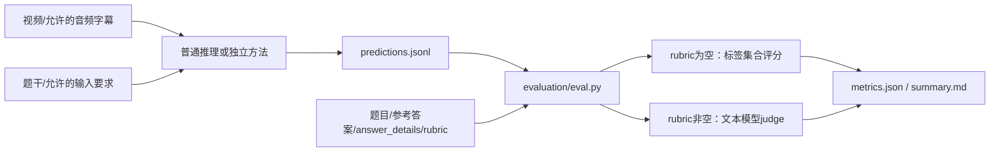

# LongEmo 当前评测代码核验与方法接入协议

核验日期：2026-09-16。仓库为私有仓库；本次通过用户授权的 GitHub token 只读访问，固定 `main` 提交 [`b29b70a361bf6d7b08d4907167720f288fdbc2fe`](https://github.com/mcflurryshuoz/LongEmo/tree/b29b70a361bf6d7b08d4907167720f288fdbc2fe)。下载了 29 个相关文件，逐一核对 Git blob SHA，全部一致。本地 `sources/LongEmo` 是重点文件快照，不是完整 clone；没有修改这些源码或远程仓库。

**结论：episode 是按每题 rubric 进行的文本 judge 评测；方法可以独立实现，只需导出 `question_id + prediction`。当前 main 有普通推理和 Agentic 源码，但情感记忆方法仍是占位，Agentic 入口存在已复现的启动错误。**

此次未取得 HF 门禁内的题目正文，未运行真实模型或 benchmark。因此下文是代码契约与离线验证，不是实际题型数量统计、baseline 成绩或失分归因。

## 1. 执行链与输入边界



| 层 | 当前实现 | 行为 |
|---|---|---|
| 题目和提交加载 | `evaluation/io_utils.py` | JSON 对象、JSON 数组、JSONL 或非递归目录；按显式 `granularity` 选择 |
| 普通推理 | `evaluation/inference/run.py` | video/audio/text；episode 视频输入强制转采样帧 |
| 主动补看 | `methods/agentic/runner.py` | 粗采样 → 模型请求时间段 → 补帧 → 作答；启动问题见 §5 |
| 新图谱方法 | `methods/longemo/__init__.py` | 仅保留命名空间，尚无构建/检索实现 |
| 评分入口 | `python -m evaluation.eval` / `longemobench-score` | 不依赖预测由哪个方法生成 |
| judge | `evaluation/judge_prompts.py` + `evaluation/clients.py` | 不看视频；按每题 rubric 给一个整数档位 |
| 汇总 | `evaluation/metrics.py` | 分题型、整体等题权重、推理子项 60/40、coverage |

普通推理的 `build_messages()` 只组织题干、显式传入的字幕和答题要求，没有把 `answer`、`answer_details`、`rubric` 自动交给答题模型。合成 sentinel 用例验证了该边界。新方法应进一步用输入字段白名单隔离，而不是直接序列化整条 question。[提示词构造](/Users/yingmanji/Documents/ChatGPT/emo/sources/LongEmo/evaluation/inference/prompts.py:45)

## 2. 题型与评分

下表为 README 声明且与评分分支一致的任务协议；**实际分流依据是 `rubric is None`，满分来自该题 `rubric.scores` 的最大整数键，不按题型硬编码**。HF 每题内容是否符合此协议仍需下载后核验。[评分入口](/Users/yingmanji/Documents/ChatGPT/emo/sources/LongEmo/evaluation/eval.py:64)

| 粒度 | `type` | 输出 | 评分与主归一化分 |
|---|---|---|---|
| clip | `contextual emotion` | EMOTIC 标签集合 | 本地 P/R/F1/EM；F1 进入整体成绩 |
| clip | `emotion transition` | `before` / `after` 标签集合 | 两个槽分别计 P/R/F1/EM，再逐指标平均；F1 进入整体 |
| clip | `emotion influence` | EMOTIC 标签集合 | 同标签集合评分 |
| clip | `emotion trajectory` | 自然语言文本 | judge，声明范围 0–4，归一化除以满分 |
| clip | `emotion cause` | 自然语言文本 | judge，声明范围 0–3 |
| episode | `emotional intensity comparison` | 明确结果/可接受结果之一 | judge，声明范围 0/1 |
| episode | `emotion trajectory` | 指定范围内的情绪发展文本 | judge，声明范围 0–4 |
| episode | `emotional reasoning` | 结果或解释文本 | 结果声明 0/1；解释声明 0–3；均用 judge |

### 2.1 标签题的细节

- 固定 26 个英文标签；规范大小写、空白、集合去重，不做情绪同义词映射。`happy` 不等于 `happiness`，中文标签也不会自动翻译。
- 多报标签降低 precision，漏报降低 recall。主要分数是每题 F1 后按题平均，不是全数据标签 micro-F1。
- 未知标签会作为预测项保留并记录解析警告；有 `parse_error` 并不必然剔除该题，标签题通常仍为 `status=ok` 并计分。
- transition 的 EM 是两个槽的 EM 均值，所以可以是 **0.5**，不是“前后均完全正确才算 1”的整题 EM。

[标签计算与汇总](/Users/yingmanji/Documents/ChatGPT/emo/sources/LongEmo/evaluation/metrics.py:8)

### 2.2 episode 短答案也必须经过 judge

计数 `"3"`、`"Yes"`、人物名、强度极值等不使用本地 exact match。必须提供 `--model`；JSON 数值 `3` 会触发 `open-ended predictions must be text`，字符串 `"3"` 才能进入 judge。不能用本地数字精确匹配的分数替代正式成绩。[评分分支](/Users/yingmanji/Documents/ChatGPT/emo/sources/LongEmo/evaluation/eval.py:102)

judge 接收且仅接收：`question`、`answer`、`answer_details`、`prediction`、`rubric`。返回必须只有 `score` 和非空 `reason`；`score` 必须是该题 rubric 允许的整数，布尔值不算整数。默认最多尝试 3 次，失败记为未评分。裁判模型不是仓库固定的某个型号，实验必须另行冻结。[judge payload/校验](/Users/yingmanji/Documents/ChatGPT/emo/sources/LongEmo/evaluation/judge_prompts.py:267)

### 2.3 rubric 对方法设计的含义

全局 judge 指令要求按题目所需内容判断正确性与完整性，不因篇幅、重复或词面相似额外给分。`answer_details.items` 是参考信息，不能直接按条目数累计分数。

仓库提示词中的四个示例是 **judge few-shot 示例，不是本次读到的 HF 真题**。其中轨迹示例的 3/4 分要求所有必要阶段及顺序、核心含义正确，仅允许阶段内部的轻微遗漏；缺掉一个关键阶段的连贯部分回答示例得 2/4。原因示例漏掉一个必要原因得 2/3；某些极值题可接受多个答案中的任一个。不可把这些示例的具体阶段数量或判分档位机械推广到全部题目。[完整 judge 提示词](/Users/yingmanji/Documents/ChatGPT/emo/sources/LongEmo/evaluation/judge_prompts.py:10)

因此，图谱首先要提高目标故事线的**阶段召回、时间顺序、情绪对象绑定和原因完整性**。最终答案用问题要求的粒度表达；证据 ID、节点数、解释长度本身不是加分项。

## 3. 聚合公式与完整性

设已成功评分题集为 V，每题原始分为 s_i、该题满分为 M_i：

```text
z_i = s_i / M_i
overall_unweighted.normalized_mean = mean(z_i for i in V)
percent_score = normalized_mean * 100
coverage = n_scored / n_total
```

clip/episode 分开评估。各 task 同样按其已评分题目等权平均；整体不是先求各题型均分再等权平均，因此题型频次会影响整体成绩。标签题的 z_i 为 F1。

仅对 episode 的 `emotional reasoning` 额外分组：`max_score == 1` 归 result，`max_score > 1` 归 explanation。两组均有已评分题时：

```text
emotional_reasoning.weighted = 0.6 * mean(result) + 0.4 * mean(explanation)
emotional_reasoning.unweighted = mean(all scored reasoning questions)
```

**60/40 只用于 emotional reasoning 子项，不会进入 `overall_unweighted`。** 如果某组没有已评分题，代码对剩余权重重新归一化，结果等于有分的那一组均分。[推理聚合](/Users/yingmanji/Documents/ChatGPT/emo/sources/LongEmo/evaluation/metrics.py:88)

缺失、空白和评测错误不计入均分。合成检查中两题只成功答对一题，官方归一化均分仍为 1.0，coverage 为 0.5，进程返回 1。这是当前明确声明的评测行为，不应通过修改正式分母得到不同口径。

实验报告要求：固定同一题单，整体及每题型 coverage 均为 100% 后才用于完整成绩比较；judge 错误补评，生成失败补跑或如实报告未完成。可以补充“失败按零”的工程指标，但必须另命名，不替代官方分数。不得选择性提交/剔除难题提高均分。

## 4. 新方法的提交协议

episode 最小提交为 UTF-8 JSONL，每题恰好一条；以下题号仅作合成示意：

```jsonl
{"question_id":"synthetic_count","prediction":"3"}
{"question_id":"synthetic_trajectory","prediction":"先因……感到期待，随后在……后转为不安，最后……。"}
```

当前兼容 `pred_answer`，但新方法统一用 `prediction`。`prediction` 为 null 或空白时才回退 `pred_answer`；若两者都无有效值则缺失。评分不以提交记录里的 `status` 代替答案检查。

提交前做轻量校验：题号集合与冻结题单一致、无重复无多余、episode 答案全部非空字符串、只导出最终答案；图谱快照、检索轨迹、证据引用与成本另存日志。自有普通 runner 会剥离完整 `<think>` 标签，外部文本提交在开放题评分分支不会经过同样清理，故应在导出时明确 final answer 字段。

在完整仓库根目录的调用形式如下（只是接口示例，本轮没有执行模型评测）：

```bash
python -m evaluation.eval \
  --data-path /ABS/frozen_episode_questions.jsonl \
  --predictions /ABS/run/predictions.jsonl \
  -g episode \
  --model "$JUDGE_MODEL" \
  --output-dir /ABS/run/scores
```

API 配置通过既有环境变量/安全配置提供，不把真实 key 写入命令示例或产物。每次评分新建时间戳子目录，包含 `scores.jsonl`、`metrics.json`、`summary.md`；每次都会重新 judge，不复用上次评分。评分 CLI 没有推理 CLI 的 `--qid/--limit`，开发子集要生成对应的冻结题单，而不能仅减少 predictions。

## 5. 当前实现中需要处理的问题

以下问题未经修复；本轮只读取和验证。优先级按阻塞实验或影响结论的程度排列。

| 优先级 | 已核实问题 | 影响 | 后续处理 |
|---|---|---|---|
| P0 | Agentic 导入不存在的 `video_loader.file_hash` | 模块 import 即失败，无法开始推理 | 恢复哈希函数或统一媒体接口，再测真实入口 |
| P0 | Agentic parser 未定义 `tries`、`workers`，共享 `init_client` 却访问两者 | 即使修复 import，初始化仍触发 AttributeError | 补齐参数/默认值，与共享 client 契约一致 |
| P1 | 预测文件重复 `question_id` 静默覆盖，最后一条生效 | 合并多次运行可能混入旧预测而无报错 | 外层预检拒绝重复；后续可给 scorer 加显式验证 |
| P1 | 普通推理按题号复用成功记录，不校验模型/提示词/媒体/配置 | 换配置复用目录可能得到旧结果 | 每配置独立目录；manifest+配置哈希；变更时 `--force` |
| P1 | Agentic 按题号复用所有旧记录，包括 error | 修复临时故障后续跑仍不重试失败题 | 改为只复用成功且配置一致的结果 |
| P1 | Agentic 的 `usage` 只保存最终回答轮 | 多轮选择片段的费用被低估 | 每轮与重试分别记录，并汇总成本 |
| P1 | scorer 未显式落盘完整 judge 配置；共享 `Client.configuration()` 虽存在，但所读评分/普通推理入口未调用 | 仅凭分数文件不总能恢复 provider/请求参数 | 外层保存模型、endpoint、参数、代码/prompt hash；排除 secret |

证据：[Agentic 导入与 parser](/Users/yingmanji/Documents/ChatGPT/emo/sources/LongEmo/methods/agentic/runner.py:13)、[共享 init_client](/Users/yingmanji/Documents/ChatGPT/emo/sources/LongEmo/evaluation/inference/runner.py:122)、[预测覆盖](/Users/yingmanji/Documents/ChatGPT/emo/sources/LongEmo/evaluation/eval.py:69)、[普通缓存](/Users/yingmanji/Documents/ChatGPT/emo/sources/LongEmo/evaluation/inference/runner.py:158)、[Agentic 缓存](/Users/yingmanji/Documents/ChatGPT/emo/sources/LongEmo/methods/agentic/runner.py:164)、[Agentic usage](/Users/yingmanji/Documents/ChatGPT/emo/sources/LongEmo/methods/agentic/runner.py:113)。

### 5.1 输入与预算不能仅按 CLI 名称对齐

1. **episode 默认看帧，不是原生整片视频。** 普通 runner 的 episode 条件强制 frames，即使模型是 Gemini。默认上限通用 768 帧，GPT 128、Claude 80、DeepSeek 600，实际帧数还受时长、像素预算及源视频约束。`fps=2` 不意味着一小时输入 7200 帧；受 768 帧上限时名义密度约 0.213 fps。主表要保存实际帧时间戳和有效采样率。[选择 frames](/Users/yingmanji/Documents/ChatGPT/emo/sources/LongEmo/evaluation/inference/run.py:184)
2. **音频、字幕默认关闭。** 帧输入不包含音轨，需显式 `--with-audio`；“看了视频”不能推导为听过语气。原生 clip 的音轨行为不同，分表记录实际输入。
3. **字幕文件契约与 HF 发布目录不同。** episode 读取仓库根目录 `subtitles/<video_id>.json`，要求 `id/t/speaker/text`，不能直接喂 HF 的 SRT；转换时未知 speaker 保持 null。当前通用 `subtitle_text()` 最终只拼接文本，丢弃时间与 speaker。Agentic 虽有保留时间的辅助函数，runner 实际初始化调用的仍是这个通用版本。图谱构建必须保留原始时间和归属，不能只复用丢信息的字符串。[字幕读取](/Users/yingmanji/Documents/ChatGPT/emo/sources/LongEmo/evaluation/io_utils.py:172)
4. **Agentic 是按题补帧，没有跨题记忆。** 默认初始 0.5 fps、最多 32 帧、3 次模型决策，因此最多两轮 inspect 后必须回答。每次 inspect 可有 8 个范围，每范围最多 768 帧；这些是局部限制，不能等同于与直答相同的总帧预算。音频/字幕在开始时固定，后续动作只补视觉。需要加每题累计媒体、token、轮数限制后才能做预算公平对照。

## 6. 对两阶段 plan 的具体修订

1. **不改评分器来适配方法。** 在独立方法中构建、保存图谱，最后写标准 predictions；评分使用上述固定提交及冻结 judge 配置。
2. **基础记忆按视频复用，问答按题独立。** 基础构建只读允许的媒体；每题在同一快照上检索/补看，不能把其他题的答案或修改混入后续题。
3. **轨迹优先保证覆盖。** 人物 × 情绪对象 × 题目范围取完整轻量时间线，再检索各阶段证据；top-k 相似度不能替代完整阶段召回。最终输出阶段顺序、核心情绪及关键转折。
4. **原因优先保证关系完整。** 保存触发事件、人物如何理解它、对应的情绪/行为，并区分有证据的原因与假设；不把多因素解释压成一个泛化标签。
5. **极值/计数优先保证候选完整与去重。** 全范围召回 → 同标准比较/事件去重 → 代码辅助排序计数 → 文本答案。统计仍由官方 judge 判分。
6. **基线先可运行再比较。** 修复 Agentic 启动、失败恢复和成本日志后，作为主动选片对照；B3/B4 使用同一份观察比较平铺与图检索。直接推理的采样帧上限、音频和字幕条件必须显式固定。
7. **成绩与完整性一起锁定。** 主表记录整体等题权重分数、三类 episode 任务分数、推理结果/解释及 60/40 子项、coverage、构建摊销费用与逐题费用。缺少真实题型频次前，不猜测哪类题在 overall 中权重最大。

## 7. 验证记录与剩余边界

使用真实评分函数、真实 parser 和合成题单进行了 **23 项离线检查**，包括标签语义、transition EM、重复题号、缺失分母、judge 文本类型、推理权重、输入标注隔离、缓存及成本记录。评分调用中的 judge 为内存 mock，网络调用为零。

Agentic 的未修改模块导入失败已直接复现。为检查其后续缓存和轮次逻辑，仅在测试进程内暂补 `file_hash` stub，并 mock 媒体与模型；这不是源码修复，也不构成 Agentic 可运行性证明。结果中的“passed”表示观察行为符合检查断言，**不表示已发现的问题已修好**。

可复查：[检查脚本](/Users/yingmanji/Documents/ChatGPT/emo/review_checks/check_evaluation.py)、[23 项结果](/Users/yingmanji/Documents/ChatGPT/emo/review_checks/results.json)。没有真实视频解码、服务兼容性测试或模型判分一致性实验。HF 真题正文、当前 baseline 结果、现有预测和失败日志仍需补齐，才能确定实际提分优先级。
