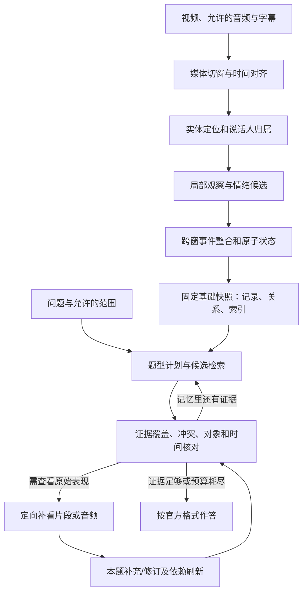

# LongEmo：情感记忆图谱与证据驱动问答计划

更新日期：2026-09-17。阶段：已在 g450 启动 E06 全量 141 视频 / 558 题实验，16 个视频并发，主模型与官方评分改用已验证的 Azure GPT-6 Astra；音频观察与 Gemini Embedding 2 使用 OpenRouter。Azure 共享限流根据实测余量已从 25 万提高为 50 万 token/分钟，保持 120 请求/分钟、最多 24 个在途请求。调度修复 eee9d3a 已推送 zyf，运行目录单独冻结；两个 Azure content_policy_violation 输入单独记录并停止重试，仍计入总分母。当前尚无全量成绩，原两题 87.5% 仅为流程验证。此前 OpenRouter-only US$2187 外推不适用于当前 Azure 费用，Azure 仅记录真实 token，账单金额待核对。

目标是提高已构建的 LongEmoBench 上的情绪理解成绩。保留两步主线：**先从视听内容构建可复用的情感记忆，再围绕问题检索、核对证据并作答**。本轮重点是把旧方案收敛成接口一致、可逐步验证、能定位失分来源的研究计划。

本文件是对 `Desktop/emo/plan_old.md` 的新版建议，不代表旧文档中全部设计已经实现。文献与选型依据见 [research.md](research.md)，访问与数据范围核验见 [research_access.md](research_access.md)，已验证的评分公式、接口和实现问题见 [evaluation_contract.md](evaluation_contract.md)。

## 1. 已了解的任务与核验边界

### 1.1 已核实

- 原始 plan 约 17 万字节，已保留为 `plan_old.md`；GitHub 原始基线固定 `b29b70a361bf6d7b08d4907167720f288fdbc2fe`。
- 已使用授权 HF 账号下载全部 558 道 episode 题目 JSON，并按固定哈希种子选取 3 段视频的全部 9 题作开发 pilot。题型总量：强度比较 194、轨迹 235、情感推理 129；视频 141 个、68,375,210,073 字节。
- 实际下载固定 HF revision `bb1933541008571883fa1eec1e7bd44d94b6ad2b`；每个题目/视频/字幕保存大小、SHA256，并核验可用 LFS 校验值。此前文献调研阶段看到的另一 revision 不用于本轮评测。
- 3 视频总长约 49 分 12 秒，pilot 共 2 道强度、5 道轨迹、2 道推理解释题，没有推理结果子类；不能代表全量覆盖。
- `key.md` 的既有资源已获用户授权使用。OpenRouter `openai/gpt-6-astra` 与 `google/gemini-embedding-2` 已通过真实调用；后者输出 3072 维向量。模型别名未提供不可变权重快照，保存实际返回型号和向量缓存。
- GPT-6 不直接接收音频；独立 Gemini 3.8 Flash 音频观察器提取有时间戳的话语、语气、停顿、笑声等，再结合视频帧和字幕输入 GPT-6。观察器不接收题目；不能把其输出当作人工真值。
- g450 使用 `/mnt/data1/zyf`，初始可用内存约 515 GiB、磁盘约 571 GiB；系统盘空间紧张。API 主流程不占 GPU。代码在 `/mnt/data1/zyf/LongEmo-zyf` 的 `zyf` 分支，数据/私密配置/实验产物独立放在 `/mnt/data1/zyf/LongEmo-runtime`。
- `methods/longemo` 已实现事件所属情绪状态、来源与修订协议、双路召回、图扩展、时间覆盖和可选补看。首个提交 `1c87407` 已推送，后续实现与记录继续增量提交。
- 正式 evaluator 的 rubric、judge prompt 和得分公式保持原样：总体为已评分题的归一化等权均值，60/40 只用于 emotional reasoning 结果/解释子项；必须同时看 coverage。新增了重复预测拒绝与配置记录。Agentic 的入口和累计 token 问题已修复。

### 1.2 当前仍待验证

1. 单视频的 2 题新方法已由原始 evaluator 评分：强度 1/1、轨迹 3/4，归一化 87.5%；这是极小范围流程验证。尚未得到完整 9 题的新方法与同模型基线成绩；此前 Flash 试跑在部分窗口 JSON 校验和尾帧抽取失败处停止，保留失败记录，不作为有效分数。尾帧精度问题已有真实 codec 回归测试。
2. 18 项实现测试通过，但身份一致性、事件完整性、检索覆盖及最终准确率仍需真实实验验证。
3. GPT-6 作为答题与同一评分模型可能有自评偏差，扩大实验时加入独立 judge，不能仅凭自评分宣传优势。
4. 旧 plan 引用的 `seg_pipeline` 和 `MEMORY_FIELDS.md` 未提供，其行为只作为历史设计参考。

### 1.3 对最终方法的判断标准

主指标遵循项目正式 evaluator，同时报告题型分数和费用。在相同模型、输入模态和预算下，验证图组织、修订及检索策略是否分别带来收益。额外报告完整系统在实际资源条件下的最好结果，二者分表。

论文问题可保留为：**怎样在长视频中维护人物针对不同事情的情绪过程，并区分视频中真正的变化与后续证据对早期判断的纠正？**

“有图谱”“有多个 agent”“有反思”“有情绪原因”均不能单独作为创新点；这些机制已有相关工作覆盖，见 §10。

## 当前实施决策（用户最新确认）

记忆的正式检索方法统一为事件图检索。两路分别为：① 人物/对象/时间/情绪条件与 BM25、查询词扩展；② Gemini Embedding 2 对完整事件证据分块编码的向量召回。每路 top-12，RRF 常数 60 融合，然后沿有证据的事件关系与人物相邻事件扩展；全局题补充时间覆盖。导航边不构成因果结论。保留每路分数、最终证据、遗漏事件和来源，不能在 embedding 失败时悄悄退回关键词检索。

主模型按用户要求用 GPT-6 Astra；独立音频步骤用于补足它的输入模态。所有新的实验与此前 Flash 图隔离。第一轮只跑固定 3 视频/9 题：主图检索、图检索 + 一次定向补看、GPT-6 直接视频帧基线。两类系统共享字幕和独立音频观察；采帧预算不同，报告为系统对照，不宣称严格等预算消融。平铺检索不作为本轮主实验。

用户进一步要求跑完整 benchmark。第一轮全量沿用已验证的 graph-only 配置，保持 GPT-6、双路事件图检索和评分协议不变，覆盖全部 141 视频/558 题；9 道开发 pilot 的重叠单独披露。新增逐视频断点续跑，评分仅重试失败项，558/558 成功后才报告全量成绩。实施命令、费用测算与当前失分线索见 [full_benchmark.md](full_benchmark.md)。

实验记录保存在代码仓库 `experiments/zyf/README.md` 与 runtime run manifests/ledgers，代码及时推送 `origin/zyf`。下面章节中的进一步研究候选不等于首版都已实现。

## 2. P0：先把 benchmark 和当前失分摸清

### 2.1 固定数据与输入协议

代码核验已完成；取得题目正文后继续生成以下审计产物，不改动原题和正式评分代码：

| 产物 | 必须包含的信息 | 用途 |
|---|---|---|
| `dataset_manifest.json` | HF revision、题目文件 SHA256、题号、视频映射、字幕映射、配置/来源 | 可复现，检测同源和缺失文件 |
| `task_inventory.csv` | 真实题型、答案格式、题数、视频数、时长、人物数估计、语言、模态需求 | 确认优化重点，避免凭示例猜分布 |
| `evaluation_contract.md`（已完成代码核验） | evaluator commit、预测 schema、评分路由、prompt、聚合公式、缺失处理；实际 judge 型号待冻结 | 避免正确答案因接口而失分 |
| `baseline_results.jsonl` | 每题预测、正式分数、调用/token/媒体量、失败类型 | 确认当前起点 |
| `error_audit.csv` | 代表题的错误阶段、必要证据、模型是否看过、存过、取过、用对 | 决定开发顺序 |

同时核对：一个 JSON 是一道题还是多道题；视频命名是否与题号无直接关系；episode/clip 是否来自相同源片；题目是否已提供人物名、时间段或选项；字幕是否原始字幕、人工说话人标签或派生标注。

当前 README 声明所有任务是开放问答。episode 输入字幕实际要求仓库根目录 `subtitles/<video_id>.json`，字段为 `id/t/speaker/text`；HF 的 SRT 需先转换，未知 speaker 保持 null。现有通用渲染只保留 text；新图谱 adapter 必须保留时间与说话人信息，不直接复用这个有损字符串。

每个实验保存 `run_manifest.json`：题单/媒体/代码/prompt hash、模型及 endpoint、解码参数、输入模态、实际帧数和时间戳、总预算、judge 配置。预测提交前校验题号唯一且完整、episode prediction 全部为最终答案字符串。当前 scorer 会静默覆盖重复预测，续跑缓存也不核对配置；不同配置使用独立目录，不能只凭已有文件判定可复用。

推理输入使用明确的允许字段列表：原视频/允许的字幕、题目、题目原带选项与允许的范围。答案、评分点、人工原因、轨迹标注及人工证据时间只交给 evaluator 或明确标记的诊断实验。先查真实字段再写适配器，不靠删除几个叫 `answer` 的字段来隔离标注。

### 2.2 按“视频来源”留出数据

当前 Hub 只声明 test，不存在已验证的官方 dev。优先使用 benchmark 构造时预留且未进入最终测评的数据开发；若没有，先制定并冻结**内部**按源视频分组的开发/保留协议。建议起点为约 20% 源视频用于开发、其余保留，仅在真实数量和题型分布核验后确定比例。

- 同视频的所有题、clip/episode 切片、重复上传及同源重剪不能跨开发与保留集合。
- 重要的剧集/人物迁移另做按剧集或来源组留出，不能只有同一集不同问题的随机拆分。
- 如果已人工查看或反复调过全部 test，要如实报告，另建未见过的最终保留集；不能把新划分称为从未见过的数据。
- 可报告全量官方 test 成绩，但若其中含调参样本，须与内部保留集成绩分列并披露使用情况。

### 2.3 第一轮错误诊断

先选约 30–50 道开发题（数量为建议），覆盖所有实际题型和不同视频，不只选择明显难题。逐题归因：

1. **感知错误**：人/说话者/听者认错，表情或语气漏看，时间错位。
2. **记忆错误**：事实曾被模型看到，但压缩丢失；合并错对象或事件；编造状态延续/因果。
3. **检索错误**：记忆里有足够证据，未取出或未取全。
4. **推理错误**：证据已给足，仍然比较、排序、计数或解释错误。
5. **输出/评分问题**：格式解析失败、语言与标签映射不一致、空输出、评审波动。

允许多标签，但指定一个主要错误。对部分样本补做“人工选片 + 同模型作答”“人工核实记忆 + 同检索器”“人工选证据 + 同答题模型”。这些是诊断对照，不是正式方法分数，也不保证构成严格上界。

## 3. 对旧 plan 的明确修订

| 旧方案已有内容/问题 | 本轮处理 | 原因 |
|---|---|---|
| 两阶段、基础构建不读题、逐题从同一快照开始 | 保留 | 同视频多题可复用，避免题目顺序影响成绩 |
| 定位 → 感知，使用音频和已有字幕，首版不额外训练 | 保留为 legacy 配置 | 不无依据推翻既有流程；后续用成本与分数比较拆分/合并 |
| §② 要求状态在事件内部，§③ 又有独立 states 和对象引用 | 统一为**事件内部原子状态是唯一真源**；派生状态索引只引用它 | 兼顾旧简化方向与可检索/可修订要求，避免两份状态漂移 |
| 一个人在一事件内只保留一段大段情绪描述，取消对象字段 | 改为允许多个有对象、时间与依据的原子状态；人物长描述仅为派生摘要 | 同时担忧面试/感激朋友无法仅靠人物粒度可靠区分 |
| “事情 T”在概览中删除、后文又使用；S 同时用于状态与语义事实 | 首版不单建事情节点，保留结构化 `target`；状态 S、语义事实 F | 消除术语与 ID 冲突；稳定事情索引可后加 |
| 每个窗口全量传实体图册 | legacy 保留；新增活跃人物+历史候选+全库回退的对照 | 降低长视频图册成本，候选漏召回必须可恢复 |
| 20 秒无重叠、5 fps | 保留 legacy；新增 20 秒核心窗+少量上下文、1/2 fps 底采样与局部加密的候选 | 用同成本实验决定采样，不把参数当成结论 |
| 事件整合、语义更新的调用数前后不一致 | 固定 3 个基础逻辑角色；语义摘要只在场景/相关记录变化时刷新 | 先算清成本，避免每窗重复大段改写 |
| 检索框架有描述，缺少明确工具返回值与覆盖检查 | 增加题型计划、结构化语义/BM25 + Gemini Embedding 2 双路召回、RRF 融合、事件图展开、时间覆盖记录 | 图里有证据不代表问答实际取得了证据 |
| 依赖刷新和解释修订已有详细思想 | 保留，增加提交协议、停止条件和错误修订指标 | 把概念变成可验证机制 |
| 仅 Naive RAG、MovieChat、M3-Agent 作为系统基线 | 补充同模型平铺情绪 RAG、WorldMM 类、多模态整片与主动选片基线 | 对照必须覆盖近期最接近工作 |
| 第一轮同时做多个通用 benchmark | LongEmo episode 优先，通用迁移放在核心收益成立后 | 先解决当前主要目标 |

所有“新增候选”都需要实验，不能在报告里写成已经证明优于旧方案。

## 4. 总体方法：基础情感记忆 + 逐题证据推理



图是一种带关系的可查询记忆，可以先用 JSONL + SQLite 实现，无需上图数据库、训练 GNN 或全量构建知识图谱。首版沿用无 embedding 的身份方案；文本 embedding 与视觉 embedding 是独立后续对照，不是两阶段方法的必要条件。

## 5. 阶段一：构建情感记忆

### 5.1 媒体与身份

**统一时间。** 存储用全片秒数及 `[start,end)`，请求中的窗口局部时间由代码映射。保存帧实际采样时间、音频范围、字幕来源及偏移；同一源帧、对白、片段有稳定来源标识。

**两套配置。** `legacy` 复现旧文档的 20 秒、5 fps、无 padding；`balanced_candidate` 以 20 秒核心窗、前后各 2 秒上下文、1 或 2 fps 为起点。首尾裁剪到合法范围，模型只为核心窗新增记录；跨窗同次反应合并，不能因 padding 多计一次。镜头切换处补帧、人物反应/模态冲突/快速动作处局部加密，4–8 fps 只用于选定片段。该调度不读取题目答案，也不能只关注说话者而忽略听者。

底采样可能遗漏短暂表情；需要比较 1/2/5 fps 的情绪证据召回与费用。发现视觉漏检占主导时优先保留足够密度，不能仅为省 token 固定低采样。人脸裁图用于细节核对，始终保留同时间的场景上下文。

**身份和对白。** 定位角色结合实际画面、音频、字幕、历史参考图分配 P ID。不能凭熟悉某部剧就绑定演员/人物名。未知说话者可为 `null` 或多个候选；区分正在说话的人、被提及者、听者、画外音。说话人不确定性传入感知与推理，不能在接口交接时悄悄变成确定值。

**图册候选优化。** 先给活跃实体和可能重现的旧实体；不匹配时可查全库。回归一个久未出现的人是必须覆盖的案例。身份误拆/误合并高时，先修身份或回退全库，不用后续情绪推理弥补。

**模态来源。** 保留原 plan 的已有字幕输入和无独立 ASR 主线。音频允许、字幕缺失时可由 omni 模型描述听到的对白，但须标记 `audio_transcribed`，不能伪装成人工字幕。绝不因视频输入参数表面包含 audio 就认定供应商实际使用了音频。

### 5.2 感知输出：观察与解释分层

每条观察至少保存：主体候选、时间、动作/表情/语气/对白等具体线索、来源引用、局部情绪候选、局限。模型先描述可见/可听线索，再提出解释；不把“他很开心”当成原始视觉事实。

重点检查以下情感现象：

- 同一人针对不同事情的并行情绪，混合情绪和强度变化。
- 表情、语气、话语语义不一致；讽刺、礼貌、压抑是候选解释，不能看到不一致就判定伪装。
- 听者反应、沉默、回避、动作中断以及非语言声音；不能让字幕替代全部音视频感知。
- 直接自述、他人评价、回忆、承诺/安慰意图、实际反应分别记录。
- 情绪未知与中性不同；没有清晰情绪证据时可不生成状态。

开放式情绪描述为主，官方离散标签在输出适配时映射。可选粗粒度 valence/arousal 只作索引或诊断，不能作为已校准真值。强度记录具体表现与局部等级/不确定性，跨场景“最强”通过候选共同核对，不能直接比较不同窗自由生成的 0–1 分。

### 5.3 唯一存储约定

| 记录 | ID | 必需语义 | 是否可作为独立证据 |
|---|---|---|---|
| 媒体来源 | `SRC...` | 原视频 hash、帧/音频/对白及时间 | 是，表示源材料；解释仍需核对 |
| 实体 | `P...` | 同一身份、名称依据、参考图、候选绑定 | 身份判断有来源，不能独立证明情绪 |
| 观察 | `O...` | 实际表现/话语、局部候选、来源与观察范围 | 可引用，多个版本不算多个发生 |
| 事件 | `E...` | 一次可区分的发生/连续互动、精确引用、关联窗口、内部状态 | 派生记录，必须回到观察 |
| 原子状态（事件内） | `S...` | 谁、针对什么、何时、情绪、支持与冲突 | 派生解释；唯一持久化于事件 |
| 关系 | `R...` | 时间/参与/延续/变化/并存/影响等有类型连接 | 派生关系，有证据引用 |
| 可选语义事实/摘要 | `F...` | 跨事件的关系、事情进展或人物摘要 | 不能增加支持票数 |

`target` 首版由 `description + entity_ids + linked_event_ids` 构成，不强制建立独立 T 节点。它表达情绪所针对的事物/事情，不等同于触发原因。可复用的 `thread_key` 只作为事情候选索引，未知时为空；同一个人物/地点/标签不足以合并事情。

事件粒度要保证可计数：一次打断、一次被拒绝与后来又一次被拒绝是不同发生；同一次对话跨多个窗口可用同一事件。整条面试故事线通过事件关联，不把整集压成一个不可拆的超级事件。

以下为**人工构造的 schema 示例，不来自 benchmark，也不是运行结果**：

```json
{
  "event_id": "E2",
  "version": 1,
  "window_ids": ["W2"],
  "video_spans": [[29, 34]],
  "description": "P2 递来面试资料，P1 接过并微笑道谢。",
  "observation_refs": ["O4@1"],
  "states": [
    {
      "state_id": "S3",
      "version": 1,
      "subject_id": "P1",
      "target": {
        "description": "P2 帮助准备面试",
        "entity_ids": ["P2"],
        "linked_event_ids": ["E2"]
      },
      "video_spans": [[29, 34]],
      "emotion": "感激",
      "intensity_description": "微笑道谢；不足以跨场景判定强度",
      "evidence_refs": ["O4@1"],
      "conflict_refs": [],
      "time_basis": "observed",
      "known_at_window": "W2",
      "status": "supported",
      "uncertainty": "不能据此判断对面试结果的担忧已经结束。"
    }
  ]
}
```

代码生成 `state_index`：`(video_id, state_id, parent_event_id, subject_id, time, target_terms, emotion_terms, version)`，检索命中后回读事件内状态。**索引和人物摘要均不维护第二份可独立修改的状态。** 状态版本变化同步更新父事件版本及索引。

不要因为节省 JSON 字段而去掉精确观察引用。`window_ids` 用于粗召回，不能替代秒级线索和因果依据。对整个事件的自然语言改写也不能替代原子记录。

### 5.4 情绪因果：加入有依据的“人物如何理解事件”

直接从事件连到情绪，容易生成“收到消息 → 悲伤”这种缺少个人意义的解释。对有原因/意图证据的状态，可选保存短结构：

`事件 → 人物对事件的理解/与其目标的关系 → 情绪及反应`。

例如“以为机会被取消”可以解释失望，但只能在视频话语、行为或跨段证据支持时保存。必要字段为描述、证据、主体、适用时间和不确定性；**不要求每条状态填满目标、责任、可控性等心理维度**，避免生成一套没有依据的内心活动。若没有证据，只保留事件先后与候选原因。

借鉴 ECFlow 的 appraisal 思路，但本项目首版不复现其 RL，也不把这一中间表示视为独有贡献。[ECFlow 原文](https://aclanthology.org/2026.acl-long.539/)

### 5.5 跨窗口更新：发展、纠错和未决分别处理

| 新证据 | 更新 | 不允许发生的错误 |
|---|---|---|
| 同一事情同一时段再次得到支持 | 补充同一状态的来源 | 同源材料多算一票 |
| 后来出现另一种针对不同事情的情绪 | 新建并行状态 | 覆盖原事情的状态 |
| 同一事情在更晚时段确实发生变化 | 新状态 + `changes_to` | 删除真实旧状态 |
| 后来的证据纠正较早时段的判断 | 修订原状态、保存旧版本、刷新依赖 | 多造一次情绪转折 |
| 证据互相矛盾或身份/对象未确定 | 保留候选 + 缺口 | 把较晚的自述自动当成真相 |
| 两段之间没有观察 | 保存空白 | 把状态无限延续或默认已经结束 |

一次修订提交包含：操作类型、目标 ID、预期旧版本、原时段、替换内容、新证据、理由和受影响依赖。代码先检查版本/来源/时间/ID，标记下游关系、摘要与索引为待刷新，更新完成后原子发布。待刷新摘要不得作为有效结论交给问答模型。

同一片段重看得到不同情绪解释属于纠错候选，不是新的发生。真实多次发生通过不同 `occurrence`/事件 ID 保留，不能用文本相似度去重。

**离线与因果时限。** 整片离线问答在协议允许时可以利用后续证据解释过去；保存状态适用时间与首次获知时间，不能据此声称在线能力。若题目/benchmark 限制只看 t 时刻前，则身份、观察、摘要与修订都须满足证据可用时间 ≤ t。限制证据可用时间不等于限制所问事件时间，两种范围分别传递。

### 5.6 基础构建的调用安排

固定逻辑角色：定位、感知、整合。语义事实/人物摘要属于整合后的可选派生工作，只在相关内容变化、场景结束或基础构建结束时刷新。角色可共用同一模型，不要求独立 agent 服务。

先沿时间顺序运行得到可复用快照。可增加一次不读题的全片一致性检查，重点检查身份冲突、重复事件与已保存未决事项；其 token 和调用单列，作为消融开关。不能靠反复扫描整集隐性增加预算。

## 6. 阶段二：问题规划、证据检索与作答

### 6.1 问题先转为证据需求

问答角色解析：题型、人物候选、目标事情、时间范围、允许的证据时间、要求的输出结构。实体/事情不确定时保留多候选；不要过早用一个误解析的 P ID 作硬过滤。

代码确认 episode 正式类型为 `emotional intensity comparison`、`emotion trajectory`、`emotional reasoning`。下面是面向检索的能力分解；次数/意图/互动等不是额外的正式 task 名称，真实频次与细分须经题目清点核实。

| 题目能力 | 需要的证据包 | 核心操作 |
|---|---|---|
| 局部情绪/事件前后 | 目标人和事件、前后具体线索、持续与短暂反应 | 比較前后，避免把听者/说者混写 |
| 情绪轨迹 | 整个目标范围的状态、转折、空白、并存关系 | 按视频时间排序、合并延续、保留反复 |
| 强度最大/两次比较 | 完整范围候选、每个候选的具体表现和上下文 | 先召回，再共同/两两比较，最后复核优胜候选 |
| 原因/意图 | 目标情绪、触发事件、人物理解、替代解释与结果 | 检查证据链；意图与实际效果分开 |
| 次数/反复 | 所有候选发生及重复窗口映射 | 语义判断“同一次”，代码计数与排序 |
| 群体情绪/互动 | 不同人的反应和相互作用 | 不用标签简单并集、平均值代替群体判断 |

评分使用整条答案的 rubric 档位，不按记忆节点、引用或参考条目数量加分。轨迹优先覆盖所问范围的必要阶段、顺序和核心情绪；原因解释覆盖有证据的必要因素；计数和比较先完成候选召回、去重和核对，再输出明确文本结果。数字也导出字符串并交由正式 judge，不另用 exact match 替换评分。每题 gold `answer_details/rubric` 只交 evaluator，不传入问答规划。

### 6.2 检索工具的最小实现

首版用结构化过滤 + SQLite FTS/BM25 + 问题同义改写 + 有类型的关系扩展。中英文情绪词和人物别称建立基于开发材料的可审计词表。词面覆盖不足时先测 query expansion，再考虑文本 embedding；embedding 不参与身份归并。

| 工具 | 输入 | 返回内容 |
|---|---|---|
| `search_memory` | 实体候选、时间、目标描述、词项、记录种类、分页 | 命中记录、总候选数、来源引用、未决标记 |
| `read_timeline` | 人物/目标候选、完整范围、分页 | 时间顺序记录、观测空白、可疑转折 |
| `expand_relations` | seed IDs、允许边类型、最大跳数 | 相关事件/状态及边的依据、冲突，避免无关扩散 |
| `read_evidence` | 指定来源或观察 ID | 原始观察/对白正文、帧/音频定位、来源版本 |
| `inspect_media` | 明确缺口、片段、模态、采样预算 | 新观察和来源、本题的修订候选 |

检索必须有独立的正文入口，允许读到**没有情绪标签**的事件/观察，避免错漏标签造成永久失忆。事件摘要负责导航，关键结论读取底层线索；不要把整个图都展开成文本交给模型。

局部问题可用候选 top-k；全片轨迹、最大值、次数问题必须先枚举指定范围内的相关记录或按时间分桶分页覆盖，再压缩。不能对 top-5 相似片段直接声称“全片最强”或“只发生三次”。候选检索的覆盖也不等于原视频所有情绪都已被感知到，报告该区别。

建议初始预算：局部首轮约 12 条候选、关系扩展 1–2 跳、最多 4 轮检索。全局题先取完整轻量索引，再分批读正文。最终证据预算以实测 tokenizer 为准，起点可为 12k text tokens，结构/摘要约占 20%、具体支持约占 60%、冲突与上下文约占 20%；比例只是候选配置。

### 6.3 回看由具体缺口触发

回看请求应包含：

```json
{
  "gap": "同一次微笑是否代表面试担忧结束",
  "alternatives": ["因结果明朗而安心", "感谢帮助，面试情绪未确定"],
  "answer_impact": "轨迹是否应加入一个安心阶段",
  "inspection_question": "记录此处微笑、道谢及前后提到面试的具体内容和语气",
  "spans": [[24, 40]],
  "modalities": ["video", "audio"],
  "max_fps": 4
}
```

上例是独立假设情境。先查后续自述或其他支持是否已在记忆；只有原始表现缺失才补看。给感知模型中性观察目标，不让它去“证明”现有答案。

起点沿用每题最多 3 次回看、累计 120 秒实际输入；重复读、padding、音频重送均计入预算，同时记录 unique seconds。控制排序采用“影响答案程度、能否观察到所需线索、成本”，暂不声称计算了校准的信息增益。

连续两轮没有新来源、没有解决缺口、没有新的可执行检索方向时停止；到预算后按现有材料给出最可支持答案，不无休止反思。复杂题可用一次针对性反例检查，但不全量增加多模型投票。

### 6.4 按操作类型得到答案

- 轨迹：按时间排列原子状态，合并有证据的延续；修订历史不成为轨迹阶段；同时存在的不同对象情绪分别表达。
- 原因：输出“所问情绪 + 有依据的触发/理解 + 关联线索”，不填补没有证据的动机。
- 强度：在相同所问情绪/人物/范围下比较；突出表情不必然代表更强内心情绪。候选并列或证据不可比时保留不确定性，最终格式服从题目协议。
- 次数：模型完成事件同一性判断，代码做唯一发生计数、排序、区间并集；避免语言模型口算。
- 标签：只映射有依据的标签；不要靠输出大量情绪词提高 recall。

保存 `prediction` 与 `trace` 分离。前者符合正式接口；后者记录引用、检索覆盖、回看、修订和费用。trace 记录证据与简短决策理由，不需要保存冗长自由推理文本。作答内容不得包含 evaluator rubric 或自拟评分指令。

## 7. 资源与预算：先验证能力，再确定模型

`key.md` 中的 `gemini-2.0-flash` 与注释中的其他名称是本地配置线索，不是当前可调用模型清单，也不是本轮已经选定的骨干。第三方代理能力不能从 Google 官方能力推断。

首批实现应增加轻量 `provider_adapter`，统一模型 ID、图片、音频/视频、结构化输出、限流、超时、重试、usage 日志。调用角色可分“批量感知”和“难题核对”，但机制对照固定同一组模型。OpenRouter 的模型卡/接口需检查输入模态和实际 provider；不能把一个 vision-only 模型用于语气感知。[OpenRouter 视频输入文档](https://openrouter.ai/docs/guides/overview/multimodal/videos)

开跑前用不含 benchmark 金标的短素材验证：图片、音频、视频、二者联合；输出时间是否对齐；是否静默丢音频；自定义 fps 是否生效；JSON 是否可解析；usage 是否返回；路由是否会自动换模型；文件上传方式是否兼容。先做少量 smoke call 后测每分钟费用，再按预算扩展。

Google 当前文档区分静态视频处理和部分模型的 agentic 视频理解。若供应商实际支持，整片原生模式应作为强基线；记录模式及底层用量，不能把模型内部主动查片当作外部图谱带来的收益。[Google 视频理解文档](https://ai.google.dev/gemini-api/docs/video-understanding)

开源候选可考察 Qwen3-Omni 的视听联合能力；情感专用模型可作为局部对照，优先评估 AffectGPT、Emotion-LLaMAv2、OneEmo 的域与接口适配。论文短片情感分数不能直接推断 LongEmo 长视频成绩。[Qwen3-Omni 技术报告](https://arxiv.org/abs/2509.17765)

**成本算清楚。** 对时长 T 秒，旧配置窗口数 `W=ceil(T/20)`。定位、感知各一次媒体请求，整合一次文本请求，则基础调用约 `3W`，未含语义刷新/修复。60 分钟约 180 窗、540 次调用；5 fps 抽出约 18,000 帧，两角色都读媒体即约 36,000 次帧输入，还没计历史图册和重试。若每窗另做语义更新，还会再加约 180 次。该例是算术估计，不是 benchmark 的平均时长或实测费用。

同视频 m 道题的摊销：

`平均每题费用 = (基础构建费用 + 全部题目的检索/回看/作答费用) / m`。

同时报告单题使用时的全部成本、多题摊销成本、首题时延和后续题 p50/p95。缓存键含媒体 hash、模型精确版本、prompt hash、采样/模态/身份版本；仅缓存相同计算，不共享各题新增解释。价格按运行日实际供应商账单/公开费率记录，本轮不估计美元金额。

## 8. 实验顺序：先诊断，再验证图谱增益

### 8.1 必须优先的同模型对照

| 编号 | 方法 | 回看 | 要回答的问题 |
|---|---|---|---|
| B0 | 只读题目；另测允许的字幕-only | 无 | 语言先验/字幕能解释多少成绩？ |
| B1 | 整片/均匀帧 + 允许的音频字幕直接问答 | 无外部循环 | 同骨干直答是否已经足够？ |
| B2 | 普通事件 caption + BM25 RAG | 无 | 普通外部记忆的起点 |
| B3 | 丰富情感观察 + 平铺检索 | 无 | 情感感知本身带来多少收益？ |
| B4 | **同一份 B3 观察** + 事件/原子状态/关系检索 | 无 | 图组织相对平铺是否增益？ |
| B5 | B4 + 解释修订和依赖刷新 | 无 | 记忆纠错本身是否值得？ |
| B6 | B5 + 题型覆盖检查及缺口驱动回看 | 有 | 主动证据获取是否有效？ |
| B7 | B3 + 同预算主动回看 | 有 | B6 优势是否仅来自多看媒体？ |

图新增的关系文字本身也提供信息；严格机制对照额外把相同关系事实平铺给 B3，固定内容与 token 预算，比较图索引/遍历是否有额外价值。B4→B5 需要同样后续证据和提交机会，不能一方多看完整视频。

B1 的整片原生采样若不可控，放在完整系统表；可控的同帧同音频条件用于公平机制表。能力受限时明确记录，不能称作等预算等输入。

当前仓库的 episode 直答统一使用采样帧，即使 Gemini 也不走原生整片；通用/GPT/Claude/DeepSeek 默认帧上限分别为 768/128/80/600，实际还受像素和源视频约束，音频字幕默认关闭。B1 必须显式设置共同预算并保存实际输入；原生长视频对照需独立实现和标记。现有 Agentic 修复启动与缓存问题后，作为主动选片基线，记录全部轮次成本并限制累计媒体量；不能用只含最后一轮的 usage 作成本比较。

### 8.2 消融按错误类型选择

优先级从高到低，不一开始跑全组合：

1. 去掉结构化情绪对象，仅按人物：看跨故事线污染和假转折。
2. 修订/真实变化不区分；有修订但不刷新依赖：看错误修订和过期摘要。
3. top-k-only vs 全局覆盖；相关性回看 vs 缺口回看：看轨迹、最大值、次数题。
4. 音频/字幕/视觉从构建开始分别去掉；另做固定身份下的感知消融并明确名称。
5. 固定窗 vs 带上下文/边界补帧；1/2/5 fps；局部加密的同费用对照。
6. 定位感知拆分 vs 合并；全实体图册 vs 候选图册；可选 appraisal 和全片一致性检查。
7. 只有词面检索 vs query expansion vs 文本 embedding；更多复杂模块须先有失分证据支持。

再做三项健壮性检查：题目顺序打乱；重复回看同一片段；把无关人物或同情绪不同事情加入候选。要求没有跨题状态泄漏、重复发生计数或无关故事线污染。

### 8.3 外部系统对照

先保留旧名单 Naive RAG、MovieChat、M3-Agent。近期优先补 **WorldMM** 和 **AffectSeek 类定位—核对基线**；MAGIC-Video 作为图+叙事链的强近邻。资源不足时先复现机制子集，必须标为 “inspired/reimplementation”，不能直接借用原方法名声称完整复现。

系统表保留原始骨干、字幕/音频条件、训练情况和媒体预算。无需为完整对比立即训练 M3-Agent、ECFlow 或整个长上下文模型。

### 8.4 指标和统计

正式主表固定当前 evaluator commit，并采用已经核实的口径：

- episode 强度比较为 0/1、轨迹为 0–4、推理结果为 0/1/解释为 0–3，这是 README 声明的范围；实际判分由每题 rubric 决定，均为文本 judge。归一化分为 `score / max_score`。
- `overall_unweighted` 对所有已评分题的归一化分等权平均；各 task 同理。三类题型不是等权，不能在未清点题型数量时假定各占三分之一。
- `emotional_reasoning.weighted = 0.6 × 结果均分 + 0.4 × 解释归一化均分`，仅在两组都有已评分题时如此；一组未评分时剩余权重重新归一化。该 60/40 不进入 overall。
- 缺失、空白和评测错误不进入均分。主表必须同时展示整体、每题型及推理两组 coverage，冻结题单达到 100% 后才比较完整成绩。失败按零可作单独工程指标，不改正式评分。
- clip 标签主分为逐题 F1；transition 的 before/after 分别计算再平均，EM 可为 0.5。固定英文标签，不做同义词/中文自动映射。

主表同时给出三类 episode task、推理两组及加权/不加权子项、overall、coverage 和成本。详细公式、接口及 23 项离线验证见 [evaluation_contract.md](evaluation_contract.md)。

额外诊断指标：

- 必要证据召回率：对人工审计的开发题，看必要片段/证据是否存入、是否检索到；没有 gold 证据时不能伪造全量 recall。
- 身份/说话人/情绪对象绑定正确率；轨迹假转折率；重复发生计数错误。
- 修订 precision、被纠正的错误数、正确→错误数、修订前后正式分数差；不能只展示成功纠错案例。
- 因果边抽查支持率，引用定位正确率，过期派生记录返回率。
- 每题费用、构建与问答分项时延、重试率、解析失败率、每分增益所需成本。

同题成对比较，置信区间按源视频 cluster bootstrap，避免把同一视频多题当作独立样本。开发阶段固定运行条件，关键对照再做适度重复；存在 LLM judge 时固定版本/prompt，盲化方法名，抽样人工核验。若模型参数不可完全确定，保存 provider/request metadata 并披露。

## 9. 实施里程碑与停止标准

| 阶段 | 工作与产物 | 进入下一阶段的条件 |
|---|---|---|
| P0 协议与诊断 | 已完成代码/评分协议核验；补真题、修复 Agentic 启动/缓存/成本、取得现有分数和 30–50 题错误审计 | schema/评分可复现，基线可运行，开发与保留分组明确 |
| P1 最小两阶段 | 少量不同视频；定位感知、事件内状态、索引、B1/B2/B3/B4 | 来源时间和引用有效，知道图与平铺差异来自哪里 |
| P2 有依据的增强 | 状态修订、覆盖检索、B5/B6/B7，按错误优先补媒体 | 目标题型有稳定收益，额外费用可解释 |
| P3 保留集评估 | 冻结 prompt/参数/模型，正式评估、成本、失败样例 | 无泄漏、结果可重跑，不基于保留集继续调参 |
| P4 扩展 | WorldMM/其他强基线、通用长视频迁移、可选训练 | 核心方法在 LongEmo 上已验证 |

建议先跑 3–5 个覆盖不同素材风格的开发视频，再扩到内部开发集合，不直接批量处理约 68 GB 的全部视频。具体数量服从题型覆盖和访问后的分布核验。

**决策规则：**

- B3 已大幅提升、B4 无收益：优先改善感知/检索，不继续增加图字段。
- 必要证据不在记忆：改善采样、听者/语气感知；多跳检索无法恢复未保存的信息。
- 证据已存未取出：优先改覆盖、索引、事件关联。
- 证据已足仍答错：改比较/计数/答案模板或难题核对，暂缓增加感知成本。
- 修订正确→错误比例高、最终分数不升：收紧修订证据要求或停用该模块。
- 图谱增益只来自更长上下文或更多媒体：据实归因，不写成关系推理创新。

首版工程文件可拆为 `data_adapter`、`media`、`provider_adapter`、`perception`、`memory_store`、`retrieval`、`qa`、`evaluation_adapter`。先完成可缓存、可恢复、日志完整的单机执行；不把分布式多 agent 调度作为研究前置条件。

## 10. 研究定位与最近工作的区别

WorldMM 已有多尺度情景、语义和视觉记忆，MAGIC-Video 已有统一多模态图和叙事链；不能把“记忆图 + 查原视频”作为主要新意。[WorldMM](https://arxiv.org/abs/2512.02425)、[MAGIC-Video](https://arxiv.org/abs/2605.08271)

AffectSeek 已在长视频中定位、验证和解释情感片段，ECFlow 已将 appraisal 与情绪原因图、一致性优化结合。因此“情感 agent 主动找片段”与“情绪因果图”都需要更具体的区别。[AffectSeek](https://arxiv.org/abs/2605.05640)、[ECFlow](https://aclanthology.org/2026.acl-long.539/)

值得验证的组合是：**具有对象与来源约束的原子情绪状态 → 明确区分状态发展和解释修订 → 按题型覆盖缺口取得证据 → 用修订前后分数与错误类型验证机制**。贡献成立与否由这些机制的实现和对照结果决定。

首轮不承诺首创或具体提升幅度。若训练阶段最终必要，可研究感知结构蒸馏、检索/回看策略的过程监督、偏好学习或 RL；必须有独立训练数据，并先确认主要瓶颈不在身份/证据缺失。不要直接对反复使用的 LongEmo test 优化奖励。

## 11. 下一步的具体交付顺序

1. 仓库与 evaluator 已核实；继续取得 episode 题目正文及已有成绩，冻结数据与 judge 配置，修复已发现的 Agentic 启动和实验记录问题，再做真实题错误审计。
2. 固定唯一 schema，用一个真实开发视频串起“观察 → 事件内状态 → 检索返回 → 最终预测”，保留可打开的来源片段。
3. 对同一份感知输出运行 B3/B4，先回答图组织有没有独立收益。
4. 据错误审计加入修订和定向回看，运行 B5/B6/B7。
5. 冻结配置、跑未参与开发的保留数据，再决定扩展到全量与外部 benchmark。

这次调研的结论是保留两步主线，同时优先解决**证据召回、对象绑定和可检验的修订**，让每一层复杂度都由实际失分与对照实验支持。


## 14. E06：Azure 全量高并发执行（2026-09-17）

以 c90ed18 冻结代码启动独立实验 azure_gpt6_full_v1，实际 Azure 返回模型 gpt-6-astra-2026-09-03。保留事件图、语义 + embedding 双路检索配置；感知、规划、回答与正式评分走 Azure，Gemini 音频观察及 3072 维 embedding 走 OpenRouter。全量原始数据已就绪，E03 仅复用哈希一致且不含问题的音频缓存，不复用 OpenRouter 感知图为 Azure 图。

本轮先启动 16 个视频，同时限定全进程合计请求和 token 数，针对 429 设置共享退避。每个视频完成后接续图检索答题与原始 evaluator；首批完整评分成功后继续队列。所有首次成功分数保留，低分不重抽；失败从检查点重试一次，额度不足或三视频耗尽重试则暂停新增工作。运行目录 /mnt/data1/zyf/LongEmo-runtime/runs/azure_gpt6_full_v1 保存全量分母 558 的覆盖率、原始调用用量、配置哈希与实验日志。

34 项相关回归检查通过。真实评测完成后再按题型、时长、证据覆盖和引用有效性整理失分，优先验证目标人物全程轨迹与上下文压缩是否改善此前发现的检索遗漏。新方法变更应开独立版本，不改正在运行的冻结源码或混入旧输出。具体启动、断点恢复和费用口径见 [azure_full_benchmark.md](azure_full_benchmark.md)。
